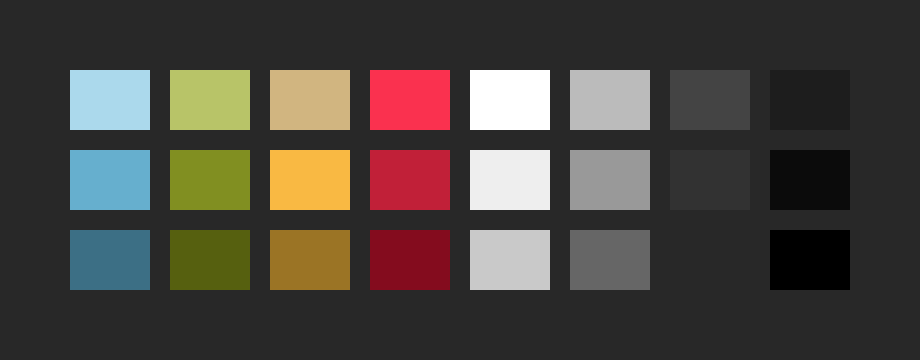
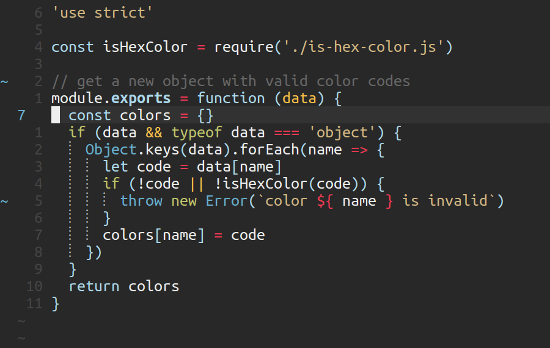
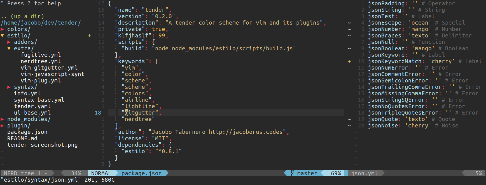
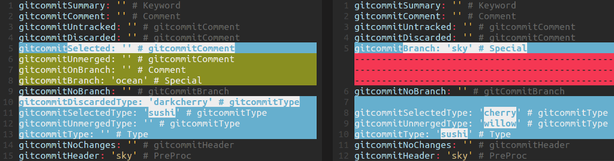
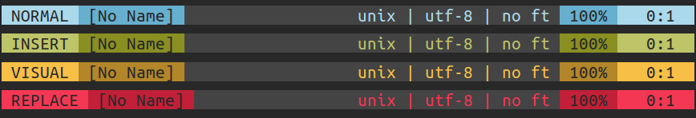
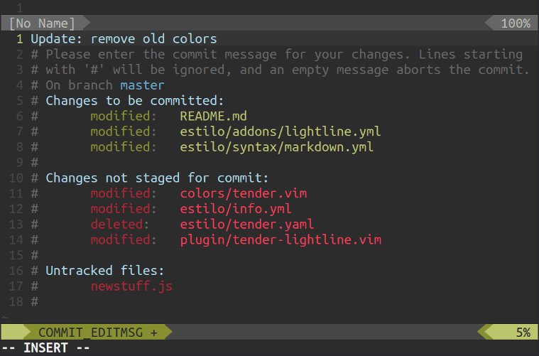

tender
======

A tender color scheme for Vim and vim-lightline.

(generated by [Estilo](https://github.com/jacoborus/estilo))




## Installation

Install manually or use a package manager:

```viml
" vim-plug
Plug 'jacoborus/tender'
" NeoBundle
NeoBundle 'jacoborus/tender'
" Vundle
Plugin 'jacoborus/tender'
```

Once your plugin is installed you can set the color scheme in your `.vimrc` or `init.vim` 

```viml
colorscheme tender
```

**Tender** includes a [lightline](https://github.com/itchyny/lightline.vim) theme, to enable it add the next line to your vim config:

```viml
" enable tender lightline theme
let g:tender_lightline = 1
" set lighline theme
let g:lightline = { 'colorscheme': 'tender' }
```

## Features:

- dark background
- tender colors
- minimal interface
- lightline theme
- fine tune colorization for languages and plugins:
  - javascript
  - css
  - markdown
  - yaml
  - json
  - gitcommit
  - NERDTree
  - GitGutter
  - pangloss/javascript
  - pangloss/javascript
  - jelera/vim-javascript-syntax
  - ... more coming soon (contributions are welcome)

## Screenshots







## Contribute

Clone the repo and install dependencies with nodejs, then follow [Estilo instructions](https://github.com/jacoborus/estilo/#step-by-step)

<br><br>

---

© 2016 [jacoborus](https://github.com/jacoborus) - Released under [MIT License](https://raw.github.com/jacoborus/nanobar/master/LICENSE)
