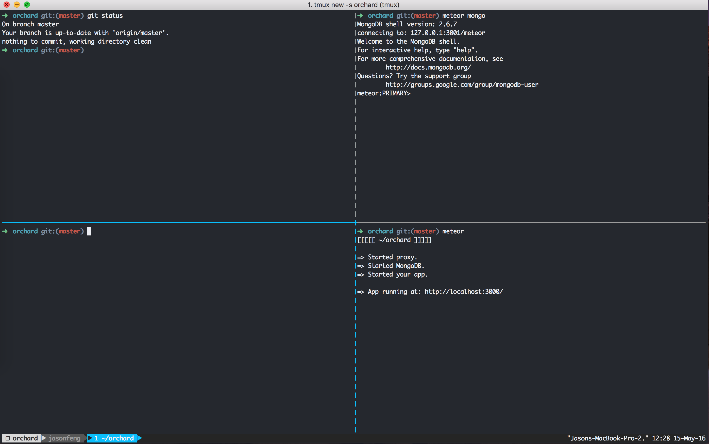
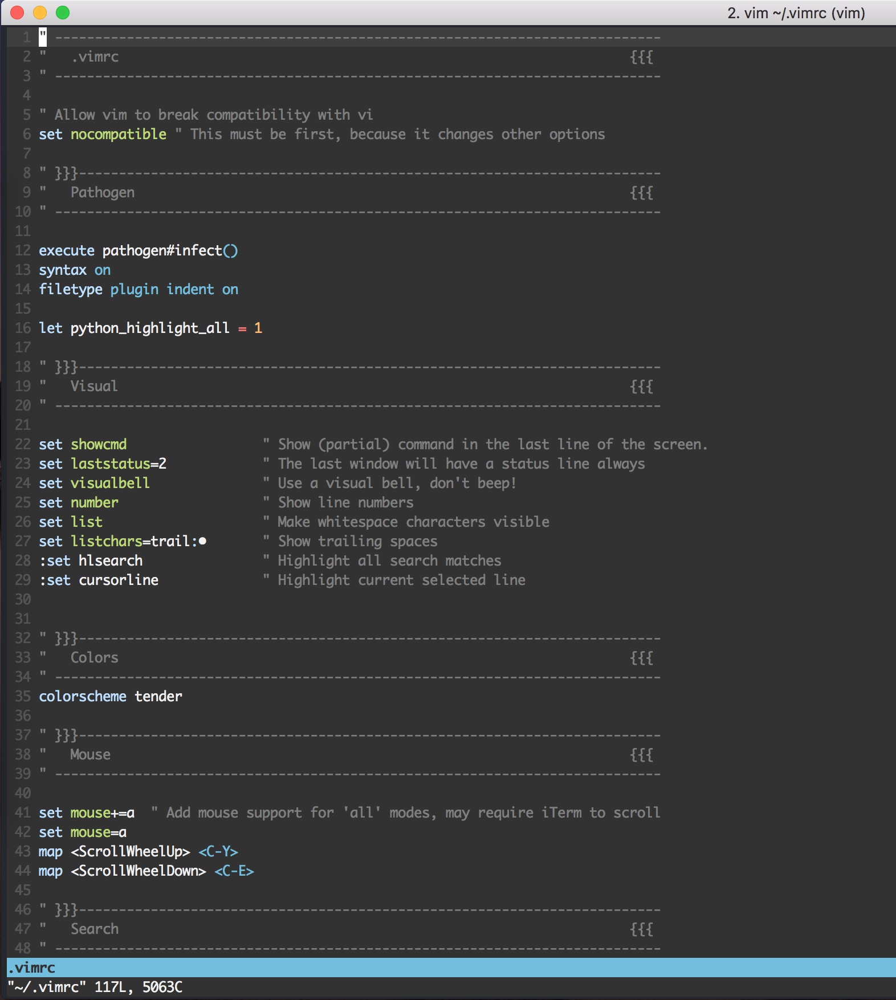

# Jason Feng's dotfiles

### Screenshots

##### Tmux and ZSH Shell

##### Vim

### Installation

`cd dotfiles && source bootstrap.sh`

### Packages and tools used

* [Oh-My-Zsh](https://github.com/robbyrussell/oh-my-zsh)
* [Vim](vim.org)
* [Pathogen](https://github.com/tpope/vim-pathogen)
* [Tmux](https://tmux.github.io/)

### Themes

* iTerm and ZSH Theme: [Honukai](https://github.com/oskarkrawczyk/honukai-iterm-zsh)

Forked from [Mathias Bynes](https://github.com/mathiasbynens/dotfiles)

